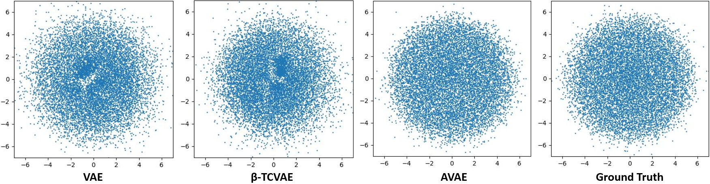
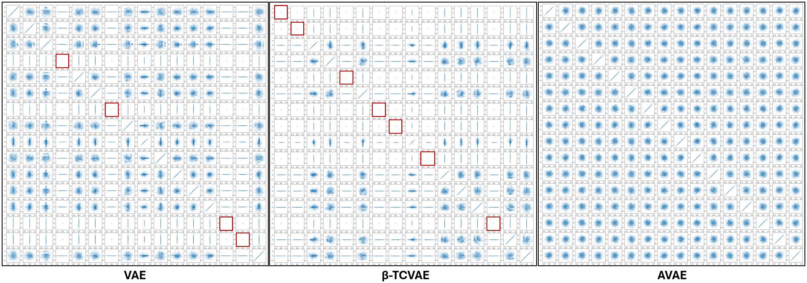
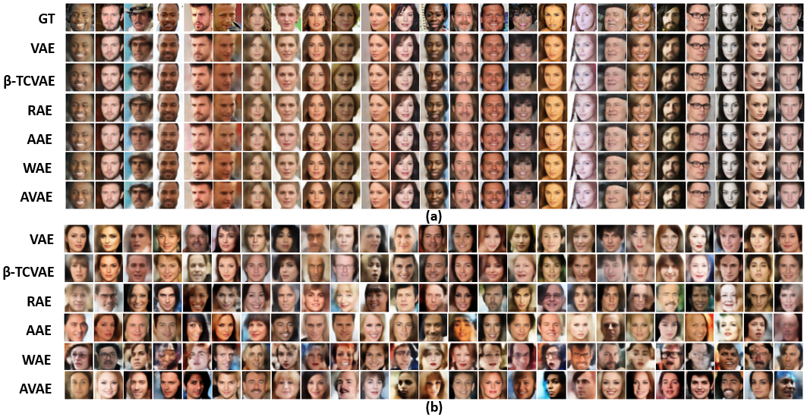

# AVAE: Matching Aggregate Posteriors in the Variational Autoencoder

> **Selected for an oral presentation at ICPR 2024.**

Official implementation of **"Matching Aggregate Posteriors in the Variational Autoencoder"**
by **Surojit Saha, Sarang Joshi, and Ross Whitaker** (Scientific Computing and Imaging
Institute, University of Utah), published at **ICPR 2024**.

The **Aggregate Variational Autoencoder (AVAE)** reformulates the VAE objective so that the
**aggregate (marginal) posterior** $`q_\phi(\mathbf{z})`$ — not just the per-sample conditional
posterior — is matched to the prior $`p(\mathbf{z}) = \mathcal{N}(\mathbf{0}, \mathbf{I})`$. It
uses a **kernel density estimate (KDE)** to model the aggregate posterior together with an
**automated, bias-corrected KDE bandwidth estimator** that makes KDE usable in
high-dimensional latent spaces ($`>100`$ dims). This directly addresses two well-known VAE
failure modes — **holes/pockets/clusters** in the latent distribution and **posterior
collapse** — **without modifying the ELBO** and **without tuning** the regularization weight
$`\beta`$.

Code: https://github.com/Surojit-Utah/AVAE

Paper (arXiv): https://arxiv.org/pdf/2311.07693

> **Relationship to prior work.** The AVAE is a direct **advancement of
> [GENs: Generative Encoding Networks](https://link.springer.com/article/10.1007/s10994-022-06220-w)**
> (Saha, Elhabian & Whitaker, *Machine Learning* **111**(11):4003–4038, 2022). GENs introduced
> KDE-based aggregate-distribution matching but was **limited to low-dimensional latent spaces**;
> the AVAE extends that idea into the **VAE framework** with an **automated, bias-corrected KDE
> bandwidth estimator**, making aggregate-posterior matching viable in **high-dimensional latent
> spaces ($`>100`$ dims)** and coupling it with automatic $`\beta`$ estimation.

---

## Table of Contents
- [Motivation](#motivation)
- [Key Contributions](#key-contributions)
- [Method](#method)
  - [Background: the ELBO](#background-the-elbo)
  - [The AVAE objective](#the-avae-objective)
  - [Automatic beta estimation](#automatic-beta-estimation)
  - [Aggregate posterior of the AVAE](#aggregate-posterior-of-the-avae)
  - [KDE bandwidth estimation (bias-corrected)](#kde-bandwidth-estimation-bias-corrected)
  - [Training algorithm](#training-algorithm)
- [Repository Structure](#repository-structure)
- [Installation](#installation)
- [Datasets](#datasets)
- [Usage](#usage)
- [Extending AVAE to a new dataset](#extending-avae-to-a-new-dataset)
- [Network Architectures & Optimization](#network-architectures--optimization)
- [Results](#results)
- [Key Findings](#key-findings)
- [Citation](#citation)

---

## Motivation

A good latent-variable model should make its **aggregate posterior** $`q_\phi(\mathbf{z})`$ match
the prior $`\mathcal{N}(\mathbf{0}, \mathbf{I})`$ everywhere. Standard VAEs constrain only the
*per-sample* posterior, so at the aggregate level they leave two visible failure modes that the
AVAE is designed to remove.

**1. Holes / clusters in the aggregate posterior.** Sampling the prior in regions the model
never populated yields poor generations. In a 2D latent, the VAE and $`\beta`$-TCVAE leave
low-density holes and uneven clusters, whereas the AVAE fills the space like the ground-truth
isotropic Gaussian:

<p align="center">
  
</p>

**2. Posterior collapse.** When latent axes revert to the prior they carry no information,
wasting model capacity and hurting reconstruction. On MNIST (l=16), pairwise latent scatter
plots show collapsed axes (red boxes) for the VAE (4) and $`\beta`$-TCVAE (7); the AVAE collapses
**none** — every dimension stays informative and Gaussian:

<p align="center">
  
</p>

---

## Key Contributions

1. **Aggregate posterior matching via KDE** inside the VAE objective, derived from first
   principles, **without any modification to the ELBO** and **without extra regularization
   terms/hyperparameters** (unlike FactorVAE / $`\beta`$-TCVAE / InfoVAE).
2. **Automated, bias-corrected KDE bandwidth estimation** that enables KDE-based aggregate
   matching in **high-dimensional latent spaces ($`>100`$ dimensions)** — a limitation of prior
   KDE-based matching (GENs).
3. **Robustness to VAE failure modes**: the AVAE avoids **posterior collapse** and
   **holes/clusters** in the latent space.
4. **Hyperparameter-free regularization weight**: $`\beta`$ is **updated automatically during
   training** from the validation reconstruction error, avoiding cross-validation.
5. **Extensive empirical validation** on multiple benchmarks with FID, precision–recall, and
   latent-space entropy, comparing favorably with SOTA likelihood-based generative models.

---

## Method

### Background: the ELBO

A deep latent-variable model maximizes the data log-likelihood
$`\max_\theta \mathbb{E}_{\mathbf{x}\sim p(\mathbf{x})}\log p_\theta(\mathbf{x})`$. Introducing a
proposal distribution $`q(\mathbf{z})`$ and applying Jensen's inequality yields the evidence
lower bound (ELBO):

```math
\max_{\theta, q}\ \mathbb{E}_{\mathbf{x}\sim p(\mathbf{x})}
\Big\{ \mathbb{E}_{\mathbf{z}\sim q(\mathbf{z})}\log p_\theta(\mathbf{x}\mid\mathbf{z})
- \mathrm{KL}\!\left(q(\mathbf{z})\,\|\,p(\mathbf{z})\right) \Big\}.
```

Choosing the **per-sample** proposal $`q_\phi(\mathbf{z}\mid\mathbf{x})`$ recovers the standard
VAE. Because the VAE constrains the conditional posterior rather than the aggregate posterior
$`q_\phi(\mathbf{z}) = \int q_\phi(\mathbf{z}\mid\mathbf{x})\,p(\mathbf{x})\,d\mathbf{x}`$, it
often fails to match $`q_\phi(\mathbf{z})`$ to the prior, producing holes/clusters, and — when
the KL term is strengthened — **posterior collapse**, via the identity

```math
\mathrm{KL}\!\left(q_\phi(\mathbf{z}\mid\mathbf{x})\,\|\,p(\mathbf{z})\right)
= I(\mathbf{x};\mathbf{z}) + \mathrm{KL}\!\left(q_\phi(\mathbf{z})\,\|\,p(\mathbf{z})\right).
```

### The AVAE objective

The AVAE models the **aggregate posterior directly** with a KDE over encoder outputs:

```math
q(\mathbf{z}) = \frac{1}{m}\sum_{i=1}^{m} K\!\left(\frac{\lVert \mathbf{z} - \mathbf{z}_i' \rVert}{h}\right),
\qquad \mathbf{z}_i' = \mathbf{E}_\phi(\mathbf{x}_i'),\ \ \mathbf{x}_i' \in \mathcal{X}^{kde},
```

with an isotropic Gaussian kernel of bandwidth $`h`$. Substituting this aggregate proposal into
the ELBO and using the deterministic encoding $`\mathbf{z} = \mathbf{E}_\phi(\mathbf{x})`$ to
evaluate the reconstruction term gives the **AVAE objective**:

```math
\max_{\theta,\phi}\ \mathbb{E}_{\mathbf{x}\sim p(\mathbf{x})}
\Big\{ \log p_\theta\!\big(\mathbf{x}\mid \mathbf{E}_\phi(\mathbf{x})\big)
- \mathrm{KL}\!\left(q_\phi(\mathbf{z})\,\|\,p(\mathbf{z})\right) \Big\}.
```

Notable design choices:
- **Deterministic encoder** (no per-axis variance), unlike the VAE — shown empirically not to
  reduce expressive power.
- **No mutual-information term** and **no extra hyperparameters** (contrast with $`\beta`$-TCVAE).
- The reconstruction likelihood $`p_\theta(\mathbf{x}\mid\mathbf{z})`$ is **Gaussian** or
  **Bernoulli** depending on the dataset.
- Closely related to WAEs (reconstruction + latent divergence), but with a KL divergence on the
  aggregate posterior and provable latent-space properties.

### Automatic beta estimation

The regularization weight $`\beta`$ (balancing the KL term against reconstruction) is set — and
**updated every epoch** — from the validation reconstruction error, removing the need for
cross-validation:

```math
\beta \leftarrow \frac{1}{n_{val}}\sum_{i=1}^{n_{val}}
\big\lVert \mathbf{x}_i'' - \hat{\mathbf{x}}_i'' \big\rVert_2,
\qquad \mathbf{x}_i'' \in \mathcal{X}^{val}.
```

### Aggregate posterior of the AVAE

For a trained AVAE (zero gradient of the KL term w.r.t. the latent encodings) with prior
$`\mathcal{N}(\mathbf{0},\mathbf{I})`$, the aggregate posterior converges **in expectation** to

```math
q_\phi(\mathbf{z}) \;\to\; \mathcal{N}\!\big(\mathbf{0},\, \mathbf{I}(1 - h^2)\big),
```

where $`(1-h^2)`$ is the **bias introduced by the KDE** (a convolution of the kernel with the
underlying distribution). **Consequence for sampling:** to generate, draw
$`\mathbf{z} \sim \mathcal{N}(\mathbf{0}, \mathbf{I}(1-h^2))`$ — not the standard $`\mathcal{N}(\mathbf{0}, \mathbf{I})`$.

### KDE bandwidth estimation (bias-corrected)

Using knowledge of the prior, the **optimal bandwidth** is chosen so a finite-sample KDE best
matches the prior:

```math
h_{\rm opt} = \min_h \mathrm{KL}\!\left(p(\mathbf{z})\,\|\,q_\phi(\mathbf{z})\right)
= \max_h\ \mathbb{E}_{\mathbf{z}\sim p(\mathbf{z})}\, q_\phi(\mathbf{z}),
```

optimized for a single scalar $`h`$ with Adam, given latent dimension $`l`$ and KDE sample count
$`m`$. In high dimensions with limited samples, $`h_{\rm opt} > 1`$, which would drive the encoder
to collapse. To fix this, the target is rescaled to $`\mathcal{N}(\mathbf{0},\alpha^2\mathbf{I})`$
and, by setting the variance equal to the KDE bias $`\alpha^2 = 1 - (\alpha h_{\rm opt})^2`$, the
**bias-scaling factor** is

```math
\alpha^2 = \frac{1}{1 + h_{\rm opt}^2}, \qquad h_{\rm opt}^{\rm corr} = \alpha\, h_{\rm opt} < 1.
```

Because $`0 \le \alpha \le 1`$, mode collapse is avoided — the system only degenerates in the
limits $`m \to 0`$ or dimension $`\to \infty`$. Representative bias-corrected bandwidths,
$`h_{\rm opt}`$ / $`h_{\rm opt}^{\rm corr}`$:

| $`l`$ | $`m{=}500`$ | $`m{=}1000`$ | $`m{=}2000`$ | $`m{=}5000`$ | $`m{=}10000`$ |
|---:|:--:|:--:|:--:|:--:|:--:|
| 10  | 0.74 / 0.60 | 0.70 / 0.58 | 0.67 / 0.56 | 0.63 / 0.53 | 0.60 / 0.51 |
| 20  | 0.89 / 0.67 | 0.86 / 0.65 | 0.84 / 0.64 | 0.80 / 0.62 | 0.78 / 0.61 |
| 40  | >1.0 / 0.72 | >1.0 / 0.71 | 0.98 / 0.70 | 0.95 / 0.69 | 0.93 / 0.68 |
| 50  | >1.0 / 0.73 | >1.0 / 0.72 | >1.0 / 0.71 | 0.99 / 0.70 | 0.98 / 0.70 |
| 70  | >1.0 / 0.74 | >1.0 / 0.74 | >1.0 / 0.73 | >1.0 / 0.73 | >1.0 / 0.72 |
| 100 | >1.0 / 0.76 | >1.0 / 0.75 | >1.0 / 0.75 | >1.0 / 0.74 | >1.0 / 0.74 |

The bandwidth **increases with dimension** and **decreases with sample size**; the
bias-corrected estimate is always $`<1`$.

### `KDE_Bandwidth/` ↔ AVAE training: the parameter flow

The **`KDE_Bandwidth/`** directory is a **mandatory pre-processing step** for AVAE training,
not an optional extra. It estimates the single scalar bandwidth $`h`$ that the AVAE loss needs to
turn a finite set of latent samples into a faithful KDE of the aggregate posterior
$`q_\phi(\mathbf{z})`$. The two components are wired together as follows:

```
  KDE_Bandwidth/KDE_bw_estimation.py                (run FIRST, once per (l, m))
     │   estimate h_opt = argmax_h  E_{z~N(0,I)} q_phi(z)   via Adam,
     │   using chi-square "annulus" importance sampling so the estimate
     │   stays accurate in high-dimensional latent spaces
     │   → emits the bias-corrected bandwidth  h_opt^corr  for (latent_dim l, kde_samples m)
     ▼
  AVAE/config/local_config.py                        (paste the value in)
     │   'latent_dim'  : l          # must match the l used for estimation
     │   'kde_samples' : m          # must match the m used for estimation
     │   'ori_bandwidth': h_opt      # <── the estimated bandwidth goes here
     ▼
  AVAE/Main.py                                        (derives the corrected values)
     │   alpha     = sqrt(1 / (1 + ori_bandwidth**2))
     │   bandwidth = ori_bandwidth * alpha            # bias-corrected h_opt^corr < 1
     │   prior_std = sqrt(1 - bandwidth**2)           # sampling std: N(0, I(1-h^2))
     ▼
  AVAE/loss/avae_loss.py :: kde_for_samples(..., kernel_band_width=bandwidth)
         uses `kernel_band_width` as the Gaussian-kernel std to compute Q(z),
         the KDE estimate of the aggregate posterior in the KL/matching term
```

**Why the coupling is strict:** the correct bandwidth is a function of **both** the latent
dimension $`l`$ **and** the KDE sample count $`m`$ (see the table above). If `latent_dim` or
`kde_samples` in `local_config.py` differ from the $`(l, m)`$ used to estimate `ori_bandwidth`,
the KDE will **mis-estimate** $`q_\phi(\mathbf{z})`$ — too small a bandwidth fragments the density
into spurious holes/clusters, too large a bandwidth over-smooths and pushes the encoder toward
collapse. Hence: **re-run `KDE_Bandwidth/` whenever you change the latent dimension or the KDE
sample count**, and keep `ori_bandwidth`, `latent_dim`, and `kde_samples` mutually consistent.

> **Upcoming (planned integration).** `KDE_Bandwidth/` is currently a separate, manual
> pre-processing step. It will be **merged into `AVAE/`** so that bandwidth estimation runs
> automatically as part of training: given `latent_dim` and `kde_samples` from
> `local_config.py`, the AVAE pipeline will estimate (and cache) the bias-corrected bandwidth
> on the fly and feed it straight into the loss — removing the manual copy of `ori_bandwidth`
> and guaranteeing the bandwidth always stays consistent with the configured $`(l, m)`$.

### Training algorithm

1. Estimate the optimal (bias-corrected) bandwidth $`h_{\rm opt}^{\rm corr}`$ given $`(l, m)`$.
2. Split data into $`\mathcal{X}^{train}`$ / $`\mathcal{X}^{val}`$; draw KDE samples
   $`\mathcal{X}^{kde}\subset\mathcal{X}^{train}`$ and set $`\mathcal{X}^{sgd} = \mathcal{X}^{train} - \mathcal{X}^{kde}`$.
3. Initialize encoder $`\phi`$, decoder $`\theta`$; initialize $`\beta`$ from validation reconstruction error.
4. For each epoch, for each minibatch from $`\mathcal{X}^{sgd}`$:
   - encode the batch, evaluate the AVAE objective (reconstruction + KL of aggregate posterior via KDE), and update $`(\phi,\theta)`$ by SGD/Adam;
   - refresh the KDE latent samples $`\mathbf{z}_i^{\prime} = \mathbf{E}_\phi(\mathbf{x}_i^{\prime})`$ with the current encoder.
5. At epoch end: update $`\beta`$; **re-sample $`\mathcal{X}^{kde}`$ at random** (shuffle) and refresh $`\mathcal{X}^{sgd}`$.

Shuffling the KDE subset every epoch changes $`q_\phi(\mathbf{z})`$ but does **not** destabilize
training, and it **improves** performance versus a fixed KDE subset.

---

## Repository Structure

```
AVAE/
├── AVAE/                     # Main AVAE model + training (TensorFlow / Keras)
│   ├── Main.py               # Entry point: --run_id, --config_id, --seed
│   ├── config/local_config.py# Per-dataset/experiment configurations
│   ├── data/                 # Dataloaders: MNIST, CelebA, CIFAR10, DSprites, Shapes3D
│   ├── models/               # Encoder/decoder architectures per dataset
│   ├── loss/                 # AVAE objective (reconstruction + KDE-based KL)
│   ├── lr_schedular/         # ReduceLROnPlateau (CustomReduceLRoP)
│   ├── train/                # Training loop (trainer)
│   ├── qol/ , util/          # Utilities
├── KDE_Bandwidth/            # Standalone KDE bandwidth estimation
│   ├── KDE_bw_estimation.py  # Estimate h_opt and bias-corrected h_opt^corr
│   ├── optim/ , utils/
├── Paper/                    # Camera-ready LaTeX (main + supplementary) — local only, git-ignored
└── README.md
```

---

## Installation

The AVAE model is implemented in **TensorFlow / Keras**; the standalone
**`KDE_Bandwidth/`** bandwidth estimator uses **PyTorch**. A typical environment:

```bash
conda create -n avae python=3.9
conda activate avae
pip install -r requirements.txt
# or explicitly:
# pip install tensorflow numpy scipy matplotlib tqdm nvidia-ml-py3 torch
```

> `Main.py` uses `nvidia_smi` (from `nvidia-ml-py3`) to auto-select a free GPU. Adjust
> `select_GPU()` if running on CPU or a managed scheduler.

---

## Datasets

Benchmarks reported in the paper (with their latent dimensions and KDE sample counts):

| Dataset | Input | Latent dim $`l`$ | KDE samples $`m`$ | Epochs |
|---|---|---:|---:|---:|
| **MNIST**   | $`32\times32\times1`$ | 16  | 10K | 50  |
| **CelebA**  | $`64\times64\times3`$ | 64  | 20K | 50  |
| **CIFAR10** | $`32\times32\times3`$ | 128 | 10K | 100 |

Inputs are scaled to $`[0,1]`$ for all datasets **except CelebA**, which is mapped to $`[-1,1]`$.
The code additionally includes dataloaders/architectures for **DSprites** and **Shapes3D**.

> **Note — shipped config vs. paper.** The table above lists the **paper's** settings. The
> shipped `AVAE/config/local_config.py` currently holds some **modified/experimental** values,
> e.g. MNIST `latent_dim=8` and CIFAR10 `latent_dim=90` (instead of 16 and 128), with their
> own `ori_bandwidth`. To reproduce the paper's reported numbers, set `latent_dim` to
> **16 / 64 / 128** for MNIST / CelebA / CIFAR10 and use the matching `ori_bandwidth`
> (re-run `KDE_Bandwidth/` for the chosen `(l, m)`).

---

## Usage

**1) Estimate the KDE bandwidth** for your $`(l, m)`$:

```bash
cd KDE_Bandwidth
python KDE_bw_estimation.py     # produces h_opt and bias-corrected h_opt^corr
```

**2) Configure** the run in `AVAE/config/local_config.py`
(`model_name`, `dataset_name`, `latent_dim`, `num_filter`, `epochs`, `batch_size`,
`kde_samples`, `learning_rate`, `ori_bandwidth`, etc.). Note that `Main.py` derives:

```python
alpha      = sqrt(1 / (1 + ori_bandwidth**2))
bandwidth  = ori_bandwidth * alpha                 # bias-corrected bandwidth
prior_std  = sqrt(1 - bandwidth**2)                # sampling std: N(0, I(1-h^2))
```

**3) Train** by selecting a configuration index and run id (run id sets the seed):

```bash
cd AVAE
python Main.py --run_id 1 --config_id 0
```

`--config_id` selects a dataset config from `AVAE/config/local_config.py`. Current mapping:
`0 = CIFAR10`, `1 = CelebA`, `2 = MNIST`, `3 = DSprites`, `4 = Shapes3D`
(plus `5, 6, …` Shapes3D variants). Verify the index against the file before running.

Each `--run_id` corresponds to a different random initialization (the paper trains **5 runs**
per dataset for statistical evaluation). To sample/generate, draw
$`\mathbf{z}\sim\mathcal{N}(\mathbf{0},\mathbf{I}(1-h^2))`$ and pass through the decoder.

Training outputs are written to `logs/{dataset_name}/Run_{run_id}/` (experiment spec,
generated/reconstructed images, latent covariance/scatter plots, TensorBoard logs, and
`Models/best_model`, `Models/intermediate_model/epoch_{50,100,…}`, and a final checkpoint).

---

## Extending AVAE to a new dataset

Adding a dataset requires **five wired steps**. The interfaces below are the exact contract the
trainer expects (verified against `train/trainer.py` and `Main.py`).

**1. Dataloader** — add `data/dataloader_<name>.py` exposing:

```python
class dataloader_<name>:
    def __init__(self, dataset_name, kde_samples, batch_size=100): ...
    def split_train_n_val_data(self):      # -> (x_train, x_val), float32 NHWC; also sets self.x_train/self.x_val
    def create_val_dataset(self):          # -> tf.data.Dataset (validation, batched, no shuffle)
    def create_kde_n_train_dataset(self):  # -> (train_dataset, kde_dataset); re-samples the KDE subset
    # attributes read by the trainer:
    #   self.batch_size, self.kde_samples, self.train_data_count, self.x_train, self.x_val
```

Images must be `float32`, shape `(N, H, W, C)`. Normalize to `[0,1]` (use `[-1,1]` only if the
decoder ends in `tanh`, as CelebA does). Ensure `kde_samples < train_data_count - batch_size`.

**2. Model** — add `models/ae_model_<name>.py` with `Encoder` and `Decoder`:

```python
class Encoder(tf.keras.Model):
    def __init__(self, latent_dim, num_filter, conv_kernel_initializer_method='he_normal'): ...
    def call(self, inputs, use_batch_norm=False, training=False):  # -> (batch, latent_dim)

class Decoder(tf.keras.Model):
    def __init__(self, latent_dim, num_filter, reg_strength=0, conv_kernel_initializer_method='he_normal'): ...
    def call(self, inputs, use_batch_norm=True, training=False):   # -> (batch, H, W, C)
```

Pick the final decoder activation to match your normalization: `sigmoid` for `[0,1]`
(MNIST/CIFAR10/Shapes3D), `tanh` for `[-1,1]` (CelebA), or `linear` logits (DSprites — the
trainer then applies `sigmoid`). For non-`[0,1]` outputs, add the matching denormalization
branch in `trainer.py` (see the existing `CelebA`/`DSprites` special-cases).

**3. Config** — add an entry in `config/local_config.py` with a new integer key and
`dataset_name`, `latent_dim`, `num_filter`, `kde_samples`, `ori_bandwidth`, etc. (copy an
existing entry as a template).

**4. Wire `Main.py`** — add the imports and a dispatch branch:

```python
from data.dataloader_<name> import dataloader_<name>
from models import ae_model_<name>
...
elif dataset_name == '<Name>':
    encoder = ae_model_<name>.Encoder(latent_dim=latent_dim, num_filter=num_filter,
                                      conv_kernel_initializer_method=conv_kernel_initializer_method)
    decoder = ae_model_<name>.Decoder(latent_dim=latent_dim, num_filter=num_filter,
                                      reg_strength=dec_reg_strength,
                                      conv_kernel_initializer_method=conv_kernel_initializer_method)
    dataloader_obj = dataloader_<name>(dataset_name, kde_samples, batch_size)
    x_train, x_val = dataloader_obj.split_train_n_val_data()
```

**5. Bandwidth** — run `KDE_Bandwidth/KDE_bw_estimation.py` for your `(latent_dim, kde_samples)`
and set the result as `ori_bandwidth` in the config (see the [parameter flow](#kde_bandwidth--avae-training-the-parameter-flow)).

> **Heads-up (hardcoded assumptions).** MNIST and CIFAR10 auto-download via Keras, but the
> CelebA / DSprites / Shapes3D dataloaders read **hardcoded absolute paths** on the authors'
> machine (e.g. `/home/sci/surojit/...`) — point these at your own data. `select_GPU()` in
> `Main.py` also contains a hardcoded hostname (`blackjack`) special-case, and
> `save_model_epochs` only saves intermediate checkpoints for runs of **≥ 50 epochs**.

> **Evaluation is not included.** FID, precision/recall, and latent-space entropy reported below
> are **not computed by this repository** (the `fid_samples` config key is unused). Training only
> logs reconstruction/KL/KDE diagnostics and sample images; reproduce the paper's metrics with
> external tools (e.g. an Inception-based FID/precision–recall implementation) on generated and
> real samples.

---

## Network Architectures & Optimization

Encoder/decoder architectures (from Tolstikhin et al. / RAE), shared across all competing
methods for a fair comparison:

| | MNIST | CelebA | CIFAR10 |
|---|---|---|---|
| **Encoder** | Conv64→Conv128→Conv256→Conv512 (BN, ReLU) → $`\mathrm{FC}_{k\times16}`$ | Conv64→Conv128→Conv256→Conv512 (BN, ReLU) → $`\mathrm{FC}_{k\times64}`$ | Conv128→Conv256→Conv512→Conv1024 (BN, ReLU) → $`\mathrm{FC}_{k\times128}`$ |
| **Decoder** | FC→TransConv256→128→64→1, Sigmoid | FC→TransConv256→128→64→3, Tanh | FC→TransConv512→256→3, Sigmoid |

- **Filters:** $`4\times4`$; transpose-conv **stride 2** (except the last decoder layer for
  CelebA/CIFAR10). `Conv`$`n`$/`TransConv`$`n`$ = (transpose) convolution with $`n`$ output filters.
- **FC width factor** $`k=1`$ for all methods **except** VAE and $`\beta`$-TCVAE, which use $`k=2`$
  (mean + variance heads).
- **Optimizer:** Adam, learning rate $`5\times10^{-4}`$, **ReduceLROnPlateau** (factor $`0.5`$,
  patience $`5`$ epochs on validation loss).
- **Batch size:** 100. **Epochs:** 50 / 50 / 100 for MNIST / CelebA / CIFAR10 (VAE and
  $`\beta`$-TCVAE use 100 epochs on MNIST for convergence).

Baseline hyperparameters (for the competing methods):

| Method | Parameter | MNIST | CelebA | CIFAR10 |
|---|---|---:|---:|---:|
| $`\beta`$-TCVAE | $`\beta`$ | 2 | 2 | 2 |
| WAE | recon-scalar / $`\beta`$ | 0.05 / 10 | 0.05 / 100 | 0.05 / 100 |
| AAE | recon-scalar / $`\beta`$ | 0.05 / 1 | 0.05 / 0.1 | 0.05 / 1 |
| RAE | $`\beta`$ / dec-L2-reg | 1e-4 / 1e-7 | 1e-4 / 1e-7 | 1e-3 / 1e-6 |

The AVAE has **no** such tuning: $`\beta`$ is set automatically.

---

## Results

All methods are trained **5 times** per dataset (different seeds); mean ± std reported.
Competing methods: **VAE**, **$`\beta`$-TCVAE**, **RAE**, **AAE**, **WAE-MMD** (IMQ kernel).

### Qualitative comparison on CelebA

<p align="center">
  
</p>

CelebA comparison across methods: **(a)** reconstructions of ground-truth (GT) faces and
**(b)** random samples drawn from the prior. The AVAE produces sharp reconstructions and
diverse, artifact-free generations, consistent with its best FID and recall below.

### Generative quality — FID ↓ and Precision/Recall ↑

| Method | MNIST FID | Prec | Rec | CelebA FID | Prec | Rec | CIFAR10 FID | Prec | Rec |
|---|---:|---:|---:|---:|---:|---:|---:|---:|---:|
| VAE          | 28.78 | 0.88 | 0.97 | 49.89 | 0.79 | 0.75 | 147.74 | 0.50 | 0.47 |
| $`\beta`$-TCVAE| 50.62 | 0.82 | 0.95 | 50.14 | 0.78 | 0.70 | 180.94 | 0.30 | 0.41 |
| RAE          | 18.79 | 0.87 | 0.95 | 48.81 | 0.81 | 0.77 | 94.34 | **0.74** | 0.47 |
| AAE          | 19.51 | 0.85 | 0.96 | 49.32 | 0.86 | 0.75 | 100.00 | 0.71 | 0.56 |
| WAE          | 25.42 | 0.92 | 0.92 | 72.01 | 0.64 | 0.75 | 140.49 | 0.42 | 0.31 |
| **AVAE**     | **13.27** | **0.92** | **0.98** | **46.00** | **0.88** | **0.85** | **90.93** | 0.72 | **0.67** |

AVAE achieves the **best FID on all three datasets** and the best recall (mode coverage),
with precision best/second-best.

### Latent-space entropy (whitened) ↑ — closeness to Gaussian (higher = fewer holes/clusters)

| Method | MNIST (l = 16) | CelebA (l = 64) | CIFAR10 (l = 128) |
|---|---:|---:|---:|
| VAE | 4.71 | 28.88 | 29.56 |
| $`\beta`$-TCVAE | 3.44 | 28.42 | 15.02 |
| RAE | 4.89 | 27.08 | 49.92 |
| AAE | 5.81 | 30.49 | 54.21 |
| WAE | 4.67 | 28.32 | 48.10 |
| **AVAE** | **7.56** | **30.96** | **55.64** |
| *Standard Normal (GT)* | *8.00* | *32.00* | *64.00* |

### Reconstruction — MSE per pixel ↓

| Method | MNIST | CelebA | CIFAR10 |
|---|---:|---:|---:|
| VAE | 0.0115 | 0.0214 | 0.0161 |
| $`\beta`$-TCVAE | 0.0181 | 0.0239 | 0.0205 |
| RAE | **0.0030** | 0.0201 | 0.0063 |
| AAE | 0.0069 | 0.0234 | 0.0101 |
| WAE | 0.0041 | 0.0199 | 0.0074 |
| **AVAE** | 0.0041 | **0.0198** | **0.0062** |

### Ablations

**KDE sample count $`m`$** (MNIST l=16, CIFAR10 l=128): AVAE is strong even with as few
as **$`m=1000`$** KDE samples, including in the high-dimensional CIFAR10 latent space —
evidence that the bandwidth estimator is accurate/robust. The paper uses $`m=10\text{K}/20\text{K}/10\text{K}`$.

**Fixed vs. shuffled KDE subset:** shuffling $`\mathcal{X}^{kde}`$ each epoch improves FID,
precision, recall, and MSE (e.g., FID improves from $`15.00`$ to $`13.27`$ on MNIST and from $`110.44`$ to $`90.93`$ on CIFAR10).

**Compute time per epoch** (NVIDIA TITAN V, 12 GB): comparable to the VAE on CIFAR10 even with
10K KDE samples (VAE 41.76s vs AVAE 53.38s); on MNIST, $`m=1000`$ suffices for fast training.

---

## Key Findings

- **No posterior collapse:** on MNIST (l=16), the **VAE collapses 4** and **$`\beta`$-TCVAE
  collapses 7** latent axes (consistent across 5 runs); the AVAE collapses none. Collapse
  reduces bottleneck capacity and inflates reconstruction error and FID.
- **No holes/clusters:** mMDS and pairwise-scatter visualizations show clustering/holes for
  VAE and $`\beta`$-TCVAE, but a clean, near-Gaussian, uncorrelated latent for the AVAE — the
  highest entropy across datasets.
- **Scales to high dimensions:** the bias-corrected bandwidth makes KDE-based aggregate
  matching viable at $`l=128`$ (CIFAR10) and beyond ($`>100`$ dims), which prior KDE matching (GENs)
  could not.
- **Rotation invariance caveat:** because the aggregate posterior is matched to an *isotropic*
  Gaussian (rotation-invariant), the **cardinal latent axes do not correspond to generative
  factors** (unlike the axis-aligned VAE). Identifying explanatory latent directions is left as
  future work.

---

## Citation

If you use this code or method, please cite:

```bibtex
@inproceedings{saha2024avae,
  title     = {Matching Aggregate Posteriors in the Variational Autoencoder},
  author    = {Saha, Surojit and Joshi, Sarang and Whitaker, Ross},
  booktitle = {International Conference on Pattern Recognition (ICPR)},
  year      = {2024}
}
```

This work advances **GENs**, which should also be cited:

```bibtex
@article{saha2022gens,
  title   = {GENs: generative encoding networks},
  author  = {Saha, Surojit and Elhabian, Shireen and Whitaker, Ross},
  journal = {Machine Learning},
  volume  = {111},
  number  = {11},
  pages   = {4003--4038},
  year    = {2022},
  doi     = {10.1007/s10994-022-06220-w}
}
```

**Authors:** Surojit Saha, Sarang Joshi, Ross Whitaker — Scientific Computing and Imaging
Institute, University of Utah
(`surojit.saha@utah.edu`, `sjoshi@sci.utah.edu`, `whitaker@cs.utah.edu`).